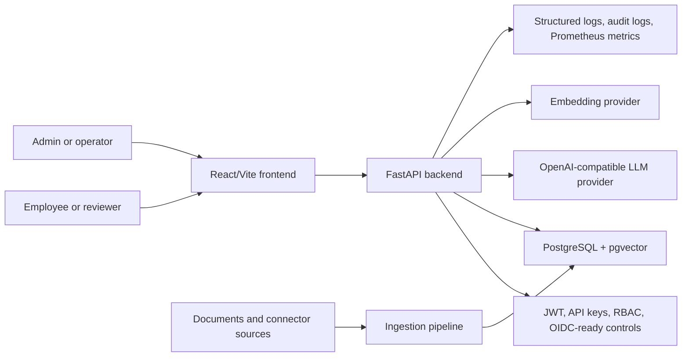
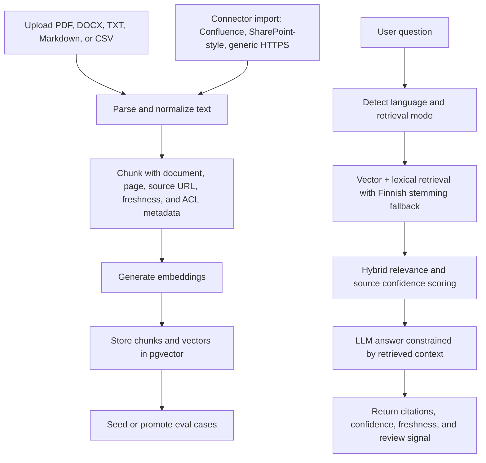
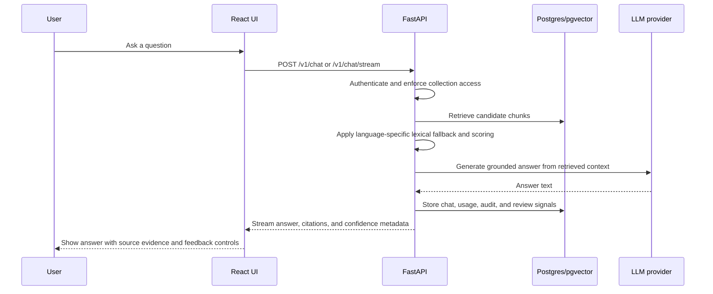
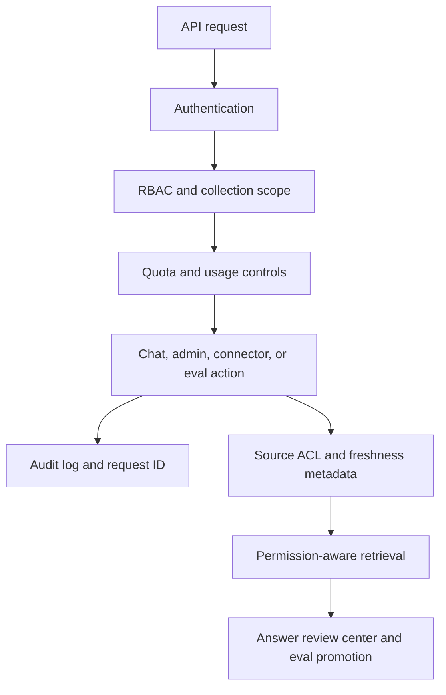

# Architecture

RAG Finland Enterprise is a full-stack RAG application for governed enterprise knowledge bases. It is designed around source-grounded answers, multilingual retrieval, administrative controls, and deployment paths for local Docker, EU cloud, and on-prem environments.

## System Context

## Ingestion And Retrieval Flow

## Runtime Request Path

## Security And Governance Boundaries

## Operational Surfaces

- **Chat workbench:** source-grounded answering with citations, answer modes, confidence, feedback, and evidence export.
- **Documents:** collection and source management for indexed evidence.
- **Admin:** users, API keys, quotas, connectors, source freshness, and ingestion jobs.
- **Review Center:** flagged-answer triage and promotion into retrieval eval cases.
- **Launch Center:** demo seed, readiness checks, connector coverage, eval scheduling, and deploy checklist.
- **Analytics:** usage, language demand, collection adoption, source confidence, feedback, and quota posture.

## Deployment Shape

The default local stack runs React, FastAPI, and PostgreSQL/pgvector through Docker Compose. Optional overlays add TLS, Prometheus, and air-gapped/on-prem packaging. Free demo deployment is documented for Vercel, Render, and Neon; production guidance favors paid EU-region infrastructure or on-prem deployment.
